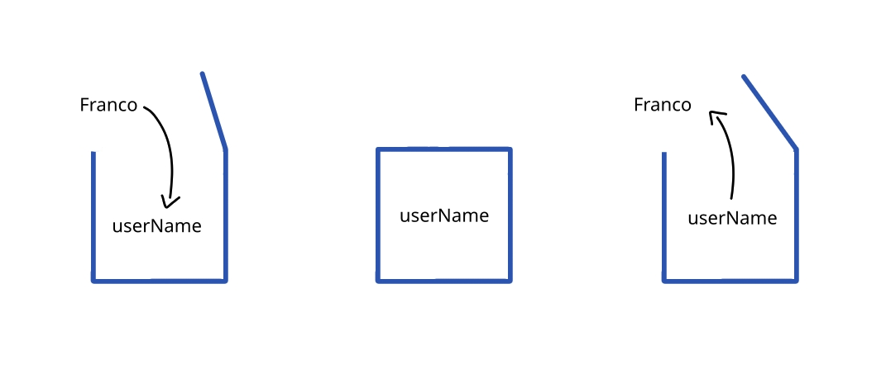

# Variables

A variable is a container for a value. We can visualize it as a box, to which we can give a name and store a value. What value? Any [data type]().

---

## Declaring a Variable

Declaring a variable is simple. You need to type the keyword `let`, then provide the name of the variable, followed by the [assignment operator]() and the value you want to store.

```js
let userName = "Franco";
```

- `let` is the keyword
- `'userName'` is the name of the variable
- '=' is the assignment operator
- "Franco" is the value



---


